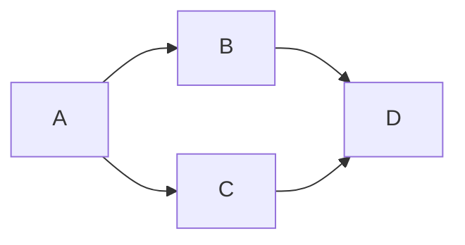
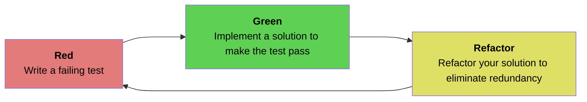
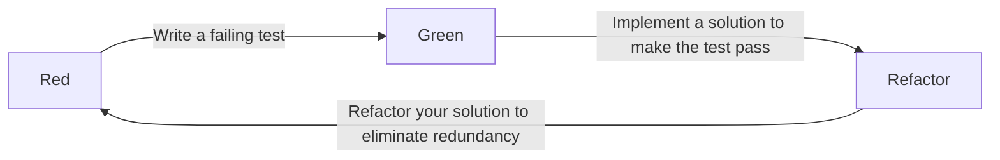
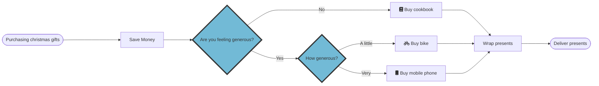
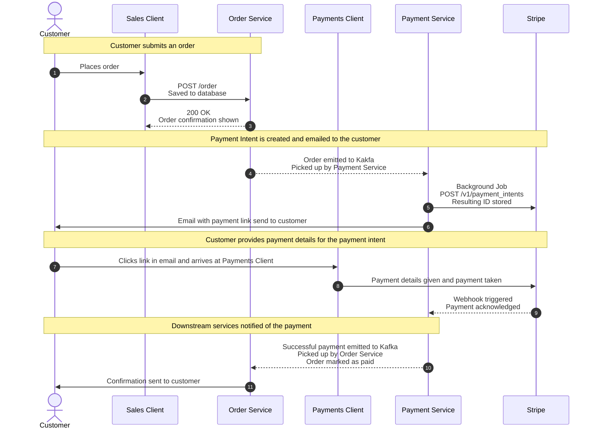
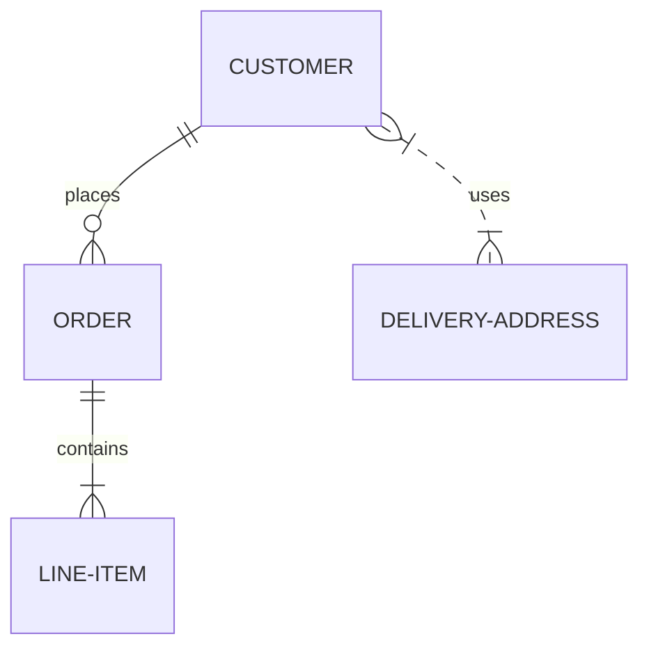
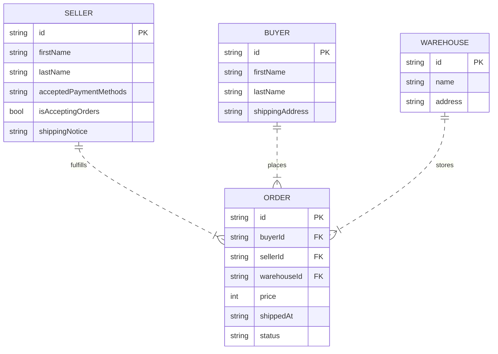
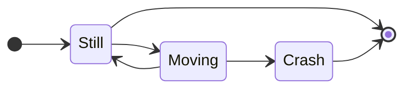
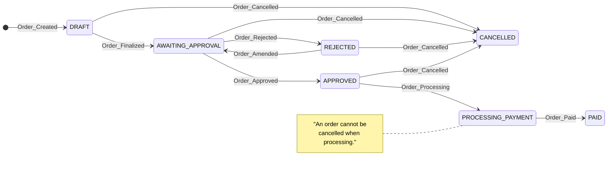

# Mermaid Diagrams

## Introduction
Mermaid lets you create diagrams and visualizations using text and code. It is a JavaScript based diagramming and charting tool that renders Markdown-inspired text definitions to create and modify diagrams dynamically.

Diagramming and documentation costs precious developer time and gets outdated quickly, but not having diagrams or docs ruins productivity and hurts organizational learning. This rotting of documentation over time can lead to numerous hours spent in an online or desktop tool trying to create of modify diagrams with varying degrees of success.

Mermaid aims to address these problems by enabling users to create easily modifiable diagrams. Some advantages of utilising mermaid are:

  - It is easy to generate, modify and render diagrams.
  - Markdown style syntax makes the tool accessible for non-developers.
  - Resulting diagrams are embeddable into mainstream tools such as GitHub, Confluence and Google Docs.

## Diagrams

### Flowchart Diagrams

#### Directions
Charts can be orientated in various directions:
  - Top to Bottom (`TB`)
  - Bottom to Top (`BT`)
  - Left to Right (`LR`)
  - Right to Left (`RL`)

Top to Bottom example:
```
flowchart TB
  A --> B
  A --> C
  B --> D
  C --> D
```


Left to Right example:
```
flowchart LR
  A --> B
  A --> C
  B --> D
  C --> D
```



#### Labels
The node identifiers used within the graph can be given labels. This can be done as configuration prior to the graphing like so:
```
flowchart LR
  Red[<strong>Red</strong><br>Write a failing test]
  Green[<strong>Green</strong><br>Implement a solution to make the test pass]
  Refactor[<strong>Refactor</strong><br>Refactor your solution to eliminate redundancy]

  Red:::redBox ---> Green
  Green:::greenBox ---> Refactor
  Refactor:::yellowBox ---> Red

  classDef redBox    fill:#e37b7b,color:black;
  classDef greenBox  fill:#5ed154,color:black;
  classDef yellowBox fill:#dee065,color:black;
```



Labels can also be applied to the links between nodes:
```
flowchart LR
  Red --->|Write a failing test| Green
  Green --->|Implement a solution to make the test pass| Refactor
  Refactor --->|Refactor your solution to eliminate redundancy| Red
```



#### Shapes / Links
There are various shapes available that correlate to the collection of shapes used within flowcharts to model processes. These are defined when annotating nodes with labels. Links can also have their length controlled by providing extra dashes to have it increased:

```
flowchart LR
  Start([Purchasing christmas gifts]) -----> Save[Save Money]
  Save ---> Generous{Are you feeling generous?}:::decisionPoint
  Generous ---> |No| CookBook[fa:fa-book Buy cookbook]
  Generous ---> |Yes| HowGenerous{How generous?}:::decisionPoint
  HowGenerous ---> |A little| Bike[fa:fa-bicycle Buy bike]
  HowGenerous ---> |Very| Phone[fa:fa-mobile Buy mobile phone]
  CookBook & Bike & Phone ---> Wrap
  Wrap[Wrap presents] ---> Deliver([Deliver presents])

  classDef decisionPoint fill:#72bad6,stroke:#333,stroke-width:4px;
```



### Sequence Diagrams

- Entities in the diagram can be split into "participants" and "actors". They will appear in the order they're defined in the diagram.
- `autoNumber` can be used to give numerical values to each step in the sequence. These numbers make it easier to reference in supporting documentation or in discussions with team members.

```
sequenceDiagram
  autonumber

  actor C as Customer
  participant SC as Sales Client
  participant OS as Order Service
  participant PC as Payments Client
  participant PS as Payment Service
  participant S as Stripe

  %% Order placed
  Note over C,OS: Customer submits an order
  C ->> SC: Places order
  SC ->> OS: POST /order<br>Saved to database
  OS -->> SC: 200 OK<br>Order confirmation shown

  %% Payment intent created and email sent
  Note over C,S: Payment Intent is created and emailed to the customer
  OS -->> PS: Order emitted to Kakfa<br>Picked up by Payment Service
  PS ->> S: Background Job<br>POST /v1/payment_intents<br>Resulting ID stored
  PS ->> C: Email with payment link send to customer

  %% User pays for order
  Note over C,S: Customer provides payment details for the payment intent
  C ->> PC: Clicks link in email and arrives at Payments Client
  PC ->> S: Payment details given and payment taken
  S -->> PS: Webhook triggered<br>Payment acknowledged

  %% Order updated and confirmation given
  Note over C,PS: Downstream services notified of the payment
  PS -->> OS: Successful payment emitted to Kafka<br>Picked up by Order Service<br>Order marked as paid
  OS ->> C: Confirmation sent to customer

```



### Entity Relationship Diagrams
ERD's can range in complexity; abtract logical models and their relationships, all the way to relational database tables and their attributes. The syntax for relationships is as follows:

```
<first-entity> [<relationship> <second-entity> : <relationship-label>]
```

Example of simple, abstract logical models:
```
erDiagram
  CUSTOMER ||--o{ ORDER : places
  ORDER ||--|{ LINE-ITEM : contains
  CUSTOMER }|..|{ DELIVERY-ADDRESS : uses
```



Example of database tables and their attributes:
```
erDiagram
  ORDER {
    string id PK
    string buyerId FK
    string sellerId FK
    string warehouseId FK
    int price
    string shippedAt
    string status
  }

  BUYER {
    string id PK
    string firstName
    string lastName
    string shippingAddress
  }

  SELLER {
    string id PK
    string firstName
    string lastName
    string acceptedPaymentMethods
    bool isAcceptingOrders
    string shippingNotice
  }

  WAREHOUSE {
    string id PK
    string name
    string address
  }

  SELLER    ||..|{ ORDER : fulfills
  BUYER     ||..|{ ORDER : places
  WAREHOUSE ||..|{ ORDER : stores
```



### State Transition Diagrams
A state diagram consists of states, transitions, events, and activities. State diagrams emphasize the event-ordered behavior of an object, which is especially useful in modeling reactive systems.

An example of a state diagram with start and end states:
```
stateDiagram-v2
  direction LR

  [*] --> Still
  Still --> [*]
  Still --> Moving
  Moving --> Still
  Moving --> Crash
  Crash --> [*]
```



An example of a left to right state diagram with labels and notes:
```
stateDiagram-v2
  direction LR

  [*] --> DRAFT : Order_Created

  DRAFT --> AWAITING_APPROVAL : Order_Finalized
  DRAFT --> CANCELLED : Order_Cancelled

  AWAITING_APPROVAL --> CANCELLED: Order_Cancelled

  AWAITING_APPROVAL --> REJECTED: Order_Rejected
  REJECTED --> AWAITING_APPROVAL: Order_Amended
  REJECTED --> CANCELLED: Order_Cancelled

  AWAITING_APPROVAL --> APPROVED: Order_Approved
  APPROVED --> CANCELLED: Order_Cancelled
  APPROVED --> PROCESSING_PAYMENT: Order_Processing
  PROCESSING_PAYMENT --> PAID: Order_Paid

  Note left of PROCESSING_PAYMENT: "An order cannot be<br>cancelled when processing."
```



## Further Information
  - [Guide to Flowchart Symbols](https://www.gliffy.com/blog/guide-to-flowchart-symbols)
  - [All You Need to Know About UML Diagrams](https://tallyfy.com/uml-diagram/)
  - [Mermaid Documentation](https://mermaid-js.github.io/mermaid/#/)
  - [Mermaid Live Editor](https://mermaid.live/edit)